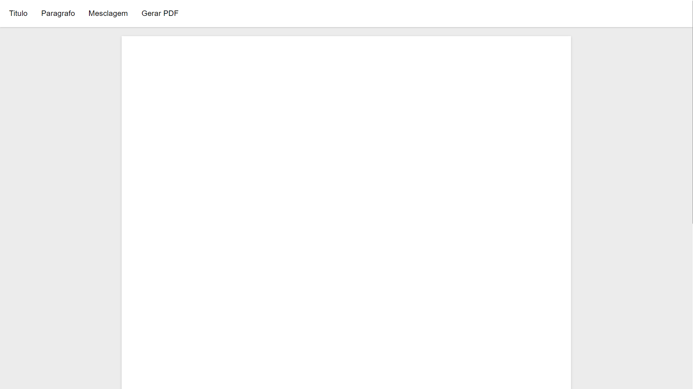

# Gerador de PDF

## Visão Geral
O projeto Gerador de PDF permite criar e personalizar seus próprios documentos PDF a partir de conteúdo HTML. Você pode escrever seu conteúdo usando parágrafos e cabeçalhos, e também tem a opção de incluir campos de mesclagem para dados dinâmicos. Depois que seu arquivo HTML estiver pronto, você pode gerar um PDF com o conteúdo formatado.

## Funcionalidades
- **Criação de Conteúdo:** Escreva e formate seu conteúdo usando parágrafos e cabeçalhos.
- **Campos de Mesclagem:** Incorpore dados dinâmicos em seu conteúdo com campos de mesclagem.
- **Geração de PDF:** Converta seu conteúdo HTML personalizado em um documento PDF profissionalmente formatado.

Com este projeto, você pode criar e gerenciar facilmente seu conteúdo textual e gerar uma versão em PDF do seu documento para compartilhamento e impressão.

<a href="https://vinicius-rodriguess.github.io/PDF-Generator/" target="_blank">Clique aqui para testar o projeto!</a>

# PDF Generator

## Overview
The PDF Generator project allows you to create and customize your own PDF documents from HTML content. You can write your content using paragraphs and headings, and you also have the option to include merge fields for dynamic data. Once your HTML file is ready, you can generate a PDF with the formatted content.

## Features
- **Content Creation**: Write and format your content using paragraphs and headings.
- **Merge Fields**: Incorporate dynamic data into your content with merge fields.
- **PDF Generation**: Convert your customized HTML content into a professionally formatted PDF document.

With this project, you can easily create and manage your text content, and generate a PDF version of your document for easy sharing and printing.

<a href="https://vinicius-rodriguess.github.io/PDF-Generator/" target="_blank">Click here to test the project!</a>
